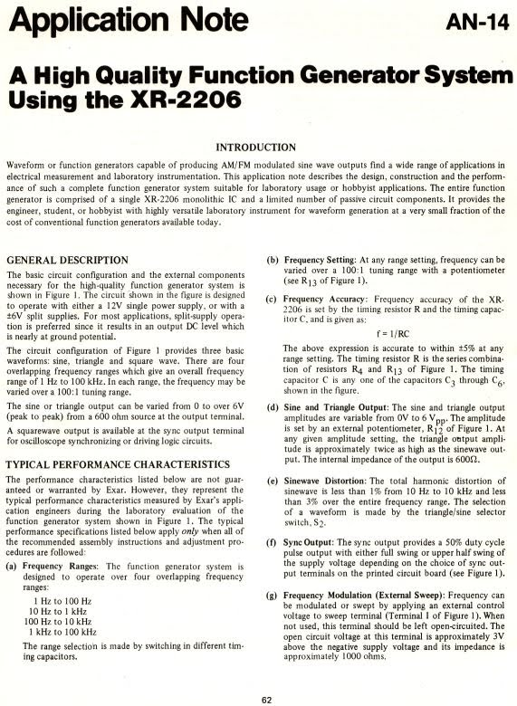
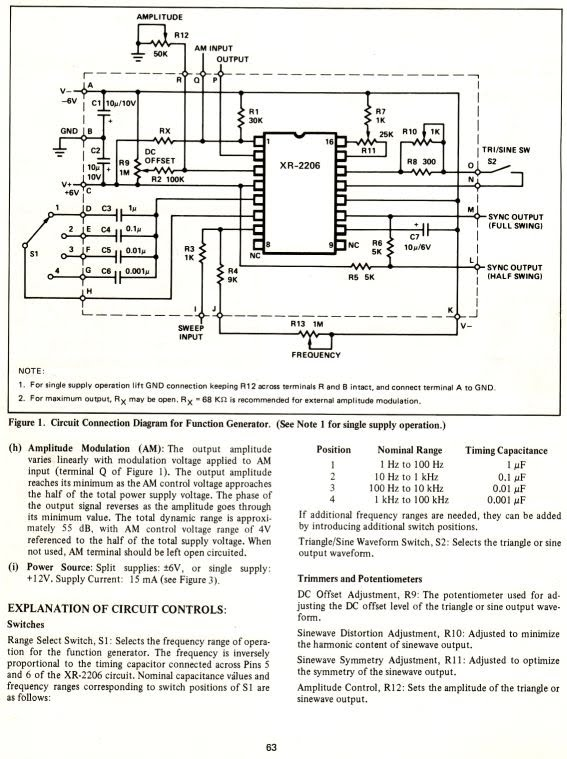
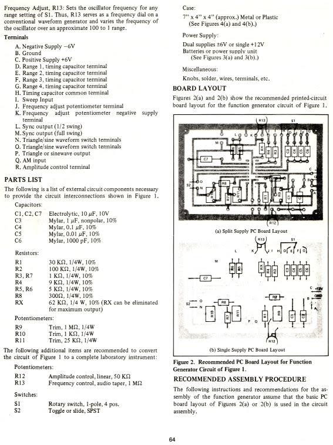
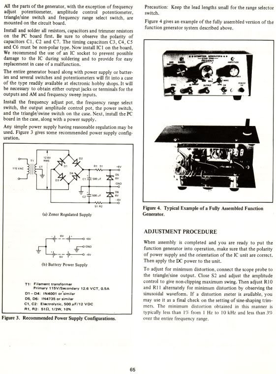
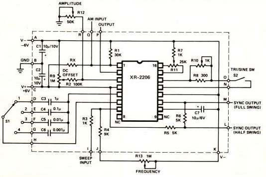
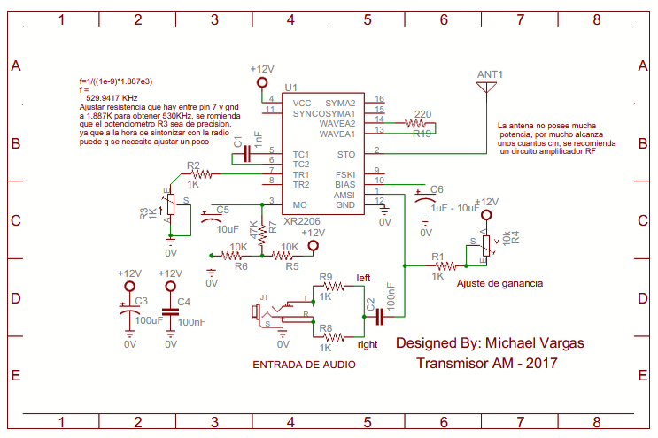

# XR2206

## Présentation

Le **XR2206** est un circuit intégré générateur de fonctions capable de produire des signaux sinusoïdaux, triangulaires, carrés ainsi que divers signaux modulés.

Cette fiche documentaire regroupe les principaux documents techniques et quelques exemples de réalisations utilisant ce composant.

---

## Notes d'application

Cliquez sur une image pour l'afficher en taille réelle.

<table>

<tr>

<td align="center">
 
Application Note AN-14 – Page 1
</td>

<td align="center">
 
Application Note AN-14 – Page 2
</td>

</tr>

<tr>

<td align="center">
 
Application Note AN-14 – Page 3
</td>

<td align="center">
 
Application Note AN-14 – Page 4
</td>

</tr>

</table>

---

## Schémas d'application

### Générateur de fonctions

*Schéma de principe d'un générateur de fonctions utilisant le XR2206.*

---

### Émetteur AM

*Exemple d'émetteur AM utilisant le XR2206.*

---

## Documents disponibles

- Notes d'application
- Schémas d'application
- Exemples de réalisations

---

## Sources

- Documentation technique Exar.
- Application Note AN-14.
- Divers montages expérimentaux.