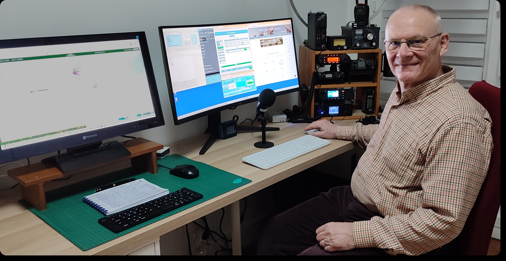

## F6CYK

La station radioamateur **F6CYK** est à l'origine d'un ensemble de travaux consacrés à la radio, à l'électronique et aux techniques de mesure. Le site documente des réalisations, des restaurations de matériels, des études d'antennes, des expérimentations HF et des méthodes de mesure appliquées à des équipements réels.

Chaque dossier s'appuie sur des observations instrumentées, des schémas, des photographies et des résultats de mesure obtenus en station. Les contenus privilégient une approche expérimentale fondée sur des réalisations effectivement construites, des restaurations intégrales et des essais reproductibles.

Les différents domaines sont organisés par thèmes afin de faciliter l'accès aux réalisations, aux instruments, aux antennes et à la documentation technique.

<figure class="accueil-photo">

<figcaption>
La station F6CYK.
</figcaption>

</figure>

## Rubriques

### Station

Présentation de l'environnement radio, des équipements, des instruments de mesure et des méthodes mises en œuvre au sein de la station.

### Réalisations

Montages électroniques, restaurations de matériels, développements spécifiques et expérimentations sur des circuits analogiques et HF.

### Antennes

Conception, construction, essais comparatifs et mesures réalisés sur des antennes compactes ou classiques.

### Documentation

Notices, dossiers techniques, ressources documentaires et archives destinés à accompagner les réalisations et les expérimentations.
